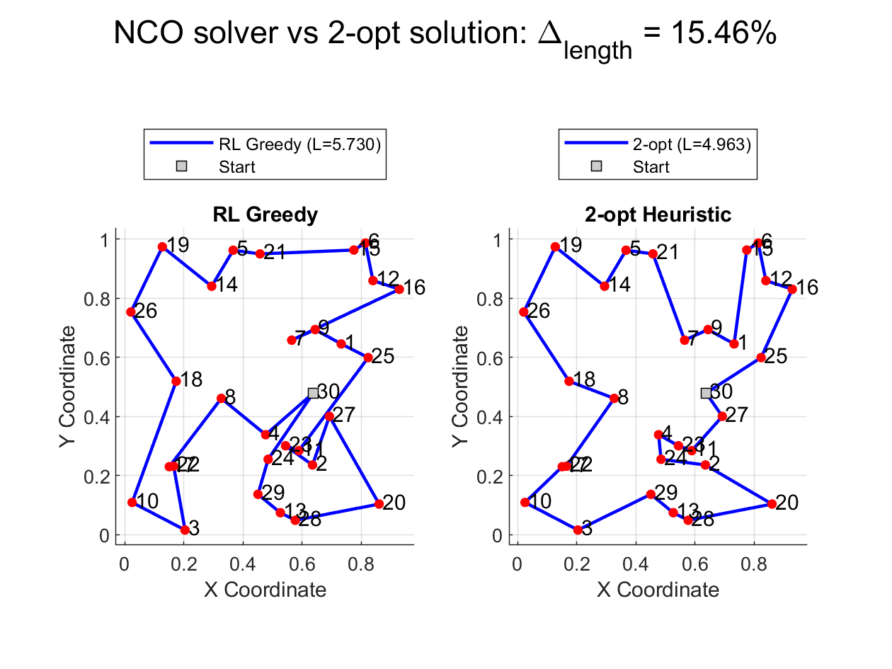
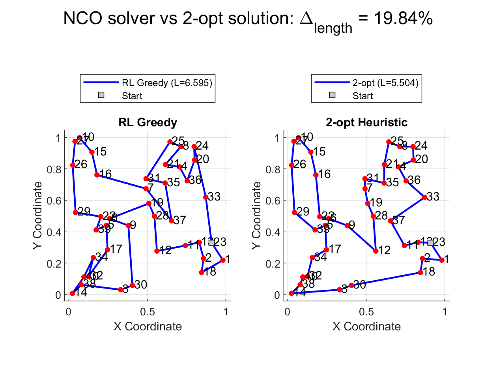

# Neural Combinatorial Optimization with Pointer Networks

*Keywords: Neural Combinatorial Optimization, Pointer Network, Reinforcement Learning*

**Combinatorial optimization** seeks the best solution from a finite—but often exponentially large—set of possibilities (e.g., tours in the Traveling Salesman Problem). Traditional solvers (branch-and-bound, integer programming) can face computational challenges on large instances, particularly due to exponential time complexity.
**Neural combinatorial optimization (NCO)** is using a different approach to solve such problems, by learning heuristics or policies using neural networks. Recent studies have demonstrated cases where NCO methods can achieve competitive performance with traditional solvers while providing significant speedups (e.g., [240× faster in some routing problems](https://arxiv.org/abs/2205.13209)), though comprehensive evaluations suggest that NCO approaches in general, ["still fall short of traditional solvers for many problems"](https://arxiv.org/abs/2209.10913) ([Ref 5](#references)). The primary advantages of NCO may be ["superior time and energy efficiency for small-size problem instances when sufficient training instances are available"](https://www.researchgate.net/publication/381126299_Neural_Combinatorial_Optimization_Algorithms_for_Solving_Vehicle_Routing_Problems_A_Comprehensive_Survey_with_Perspectives) ([Ref 4](#references)).

The MATLAB<sup>®</sup> code used in this submission implements a reinforcement learning approach to train a [Pointer Network-based deep-learning model](https://doi.org/10.48550/arXiv.1506.03134) that can act as a fast optimization solver for the **Traveling Salesman Problem (TSP)**. The custom training loop leverages principles from the [Neural Combinatorial Optimization](https://arxiv.org/abs/1611.09940) approach, incorporating:

- **Supervised Pre‑Training** with 2‑opt tours (for 2-opt method, check [Ref 3](#references)) and teacher forcing
- **Reinforcement Learning** with curriculum learning and crossing-segments penalties
- **Greedy Inference** with temperature sampling

MathWorks<sup>®</sup> products needed to run the code in the submission:

- MATLAB version R2024b
- Deep Learning Toolbox™
- Statistics and Machine Learning Toolbox™

License: The license is available in the LICENSE.txt file in this GitHub repository.

## How to run the demo

* Use the repository path and clone it to a local PC directory to save the files.
* Open the `Neural_Combinatorial_Optim.prj` MATLAB project file and run the MATLAB script `NCOdemo.m`. This script performs:
  - Supervised pre‑training using generated 2‑opt tours
  - Reinforcement learning training (with curriculum learning)
  - Greedy inference with Monte Carlo sampling

## Contents

1. [Pointer Network (PtrNet)](#pointer-network-ptrnet)
2. [Workflow Overview](#workflow-overview)
3. [Supervised Pre‑Training](#supervised-pre-training)
4. [Encoder and Decoder Networks](#encoder-and-decoder-networks)
5. [Reinforcement Learning Training Loop](#reinforcement-learning-training-loop)
6. [Greedy Inference with Monte Carlo Sampling](#greedy-inference-with-monte-carlo-sampling)
7. [Results](#results)
8. [Improvement Areas](#improvement-areas)
9. [Conclusion](#conclusion)
10. [References](#references)
11. [Appendix](#appendix)

## Pointer Network (PtrNet)

Pointer Networks were introduced by [Vinyals et al. in 2015](https://doi.org/10.48550/arXiv.1506.03134) for problems like:

- **Traveling Salesman Problem (TSP)**

- **Convex Hull finding**

- **Sorting numbers** 

where **the output is not from a fixed vocabulary** , but **a sequence of pointers**  to **elements from the input** .

**Main idea:** Instead of producing an output token from a fixed-size vocabulary, the model *points* to a position in the input.

```plaintext
Pointer Network (1 decode step)
--------------------------------

Input nodes
    ↓
[ Encoder (e.g., LSTM) ]
    ↓
Hidden states (one for each input)
    ↓
[ Attention mechanism ]
    ↓
Attention scores over input elements
    ↓
Pick one input element as output (pointer)
```

### Structure:

- An **encoder**  (e.g., LSTM) encodes all input elements into hidden states.

- A **decoder**  (e.g., LSTM again) generates outputs *by pointing* at one of the input elements **using attention scores** .

- The "pointer" is implemented by **using attention weights directly as the output distribution**  — the probability of choosing an input element.

**Key point:** 

In PtrNet, **attention is not just for helping the model focus** , it *is* the output mechanism itself.

Once the model is trained, running the inference is typically very fast (a few forward passes). This can be much faster than running complex heuristics or exact solvers, especially for larger N (where the network size allows).

## Workflow Overview

1. **Initialization and Setup**
   
   - Define hyperparameters (number of cities, hidden sizes, learning rates, etc.)
   - Build actor (pointer) and critic networks, initialize on CPU/GPU

2. **Supervised Pre‑Training** (optional but performed by default)
   
   - Generate 2‑opt tours for `preTrainSamples` instances
   - Train the pointer network with cross‑entropy loss and teacher forcing

3. **Reinforcement Learning Training Loop**
   
   - Generate random TSP batches
   
   - Actor forward pass with upgraded attention (layer normalization)
   
   - Compute rewards using a **three-phase curriculum**:
     
     - **Phase 1** (0–20% epochs): `rewards = -lengths`
     
     - **Phase 2** (20–50% epochs): introduce crossing penalty
       
       ```matlab
       rewards = -lengths - crossingWeight * crossingPenalty;
       ```
     
     - **Phase 3** (50–100% epochs): full penalties + bonus
       
       ```matlab
       rewards = -lengths - crossingPenalty + bonusFactor * max(0, (avgLength - lengths));
       ```
   
   - Critic baseline estimation, advantage calculation, gradient clipping
   
   - Adam updates for actor and critic, early stopping on average reward

4. **Greedy Inference with Monte Carlo Sampling**
   
   - Decode tours with `greedyDecode(actorNet, dlXtest, inferenceTemperature)`
   - Apply `fixCrossingsLocal` to each sampled tour
   - Keep the best tour across `numMCSamples` samples

5. **Visualization and Heuristic Comparison**
   
   - Plot training reward vs. epoch with best‑epoch marker
   - Compare RL tour and 2‑opt heuristic tour side by side

6. **Helper Functions**
   
   - Tour length computation, gradient clipping, attention step, 2‑opt, and more (see Appendix)

## Supervised Pre‑Training

The pointer network is first pretrained to imitate 2‑opt solutions:

```matlab
% Generate pre-training data
preTrainCoords = rand(preTrainSamples, numLoc, 2, 'single');
preTrainTours = zeros(preTrainSamples, numLoc, 'uint32');
for i = 1:preTrainSamples
    [tour, ~] = solveTSP_2opt(squeeze(preTrainCoords(i,:,:)), startCity);
    preTrainTours(i,:) = uint32(tour);
end

% Supervised pre-training loop
actionforcAcc = dlaccelerate(@supervisedLoss);
for epoch = 1:numPreTrainEpochs
    [gradPre, lossPre] = dlfeval(supervisedLoss_acc, actorNet, dlX, batchTours, teacherForcingRatio);
    gradPre = thresholdL2Norm(gradPre, gradThreshold);
    [actorNet, avgGradPre, avgSqGradPre] = adamupdate(actorNet, gradPre, avgGradPre, avgSqGradPre, epoch, preTrainLR);
end
```

This stage initializes the model with structured tour policies, improving convergence during RL.

## Encoder and Decoder Networks

### Encoder Network

The encoder network processes the location coordinates and transforms them into a latent representation that captures spatial relationships:

1. **Input Layer**
   
   - Takes raw location coordinates as input: 2D points (x,y) for each location
   - Format during training: [2, BatchSize, numLoc] using 'CBT' dimension ordering

2. **LSTM Encoder**
   
   - Core component is an LSTM layer with output dimension `hiddenSize`
   - Processes location coordinates sequentially, updating hidden state with each location
   - Returns sequence output for all cities: [hiddenSize, BatchSize, numLoc]
   - Creates context-aware embeddings that consider relationships between cities

3. **Projection Layers**
   
   - The encoder's LSTM output is projected into three different spaces:
     - Key projection (`fcKey`): Creates "keys" for attention mechanism
     - Value projection (`fcValue`): Creates "values" (though currently not actively used)
     - Query projection (`fcQuery`): Used by decoder to create attention queries

The encoder effectively transforms raw spatial coordinates into high-dimensional embeddings that encode the relative positions and relationships between cities, which the decoder can then use to make tour construction decisions.

### Decoder Network

The decoder network sequentially builds the tour by selecting one location at a time:

1. **LSTM Decoder**
   
   - Maintains its own hidden state that tracks the partial tour so far
   - Input at each step is the embedding of the last selected location
   - Updates its hidden state to represent current position and history

2. **Attention Mechanism**
   
   - Core of the decision-making process
   - At each step:
     - Transforms decoder's current hidden state into a "query" vector
     - Calculates attention scores by dot product between query and keys
     - Applies scaling factor (divide by √hiddenSize)
     - Masks already visited cities (sets scores to -∞)
     - Applies `softmax` to get probability distribution over remaining cities

3. **Location Selection**
   
   - During training: Samples next location based on probability distribution
   - During inference: Greedily selects location with highest attention score

4. **State Update**
   
   - Updates mask to mark selected location as visited
   - Feeds embedding of selected location as input to next decoder step

The decoder essentially implements a "pointing" mechanism, where at each step it decides which location to visit next by attending to all location embeddings and selecting one, conditioned on the history of selections made so far.

Together, these networks form a **neural combinatorial solver** that learns to construct TSP tours through reinforcement learning, with the encoder capturing the problem structure and the decoder making sequential decisions to optimize tour length.

## Reinforcement Learning Training Loop

Refer to the Workflow Overview. Notable code features:

- **Curriculum Learning** phases for reward shaping
- **Crossing Penalty** computed via `calculateCrossings` (avoid generating paths with crossed segments)
- **Early Stopping** triggered after `patience` epochs without improvement
- **Best‑Model Restoration** at early stop

An a typical notebook PC, using CPU for training (no GPU was available, but the code supports training on a GPU), the training time was around 10 min for a 50 locations problem.

## Greedy Inference with Monte Carlo Sampling

Since inference with a trained model is very fast, a large number of simulations can be performed for a given path and the best route can be selected. We use a temperature less than 1.0 (`inferenceTemperature = 0.8`) to favor exploitation.

```matlab
dlXtest = dlarray(permute(coordsTest,[3 1 2]), 'CBT');
bestLenPred = Inf;
for i = 1:numMCSamples
    tourPred = greedyDecode(actorNet, dlXtest, inferenceTemperature);
    tourPred = fixCrossingsLocal(tourPred, coordsTest);
    lenPred = computeLengths(coordsTest, tourPred);
    if lenPred < bestLenPred
        bestLenPred = lenPred;
        bestTourPred = tourPred;
    end
end
```

## Results

(the results can be regenerated using the trained actor net saved in the `NCO_trainedActor_20250429.mat` file in the repository)

The trained actor network can act as a solver for arbitrary TSP instances (of the same size it was trained for, or for different sizes) and generate a tour. It acts as a fast, learned heuristic with no optimality guarantees, and its effectiveness relies on how well its learned policy generalizes to the specific instance provided.

Some results below, for a NCO solver with 128 hidden units trained on a 50 locations path problem.
The figures show the best path taken and the total path length (comparison with the 2-opt heuristic solution).

First, we use the model trained for 50 locations on a random 10 locations path. The NCO result is marginally better than 2-opt:


Next, on a 20 locations path. In this case, NCO beats the 2-opt significantly:


30 locations path:



40 locations path:



Finally, on  a 50 locations path:


The NCO solver results and the heuristic solution are similar for paths with a small number of locations, and sometimes NCO solver is even better than the heuristic 2-opt solver, but the deep-learning model performance starts to degrade for increasingly large or complex paths. For large problems (large number of locations), the difficulty increases dramatically. To improve the NCO solver, one would need to play with the model architecture (add more layers, increase the hidden sizes), and tune some of the training parameters (learning rates, entropy, temperature, etc.).

## Improvement Areas

Constraints can be implemented in the problem, and typically there are two ways to do it:

- For **hard constraints** that must be satisfied (e.g., precedence, time windows, capacity), **Action Masking** is generally the most robust and recommended approach for Pointer Network-style models.
- For **soft constraints** or global properties checked at the end (e.g., preference for shorter edges, slight penalty for exceeding a soft time limit), **Reward Shaping** can be considered, but use it cautiously and tune penalties carefully.

For the sake of simplicity, no constraints were considered in this demo.

## Conclusion

**This demonstration has shown how a Pointer Network, when trained through a combined supervised and reinforcement learning pipeline, can act as an optimizer.**

The supervised pre‑training phase accelerates initial convergence by imitating 2‑opt solutions, while the curriculum‐based RL loop and segment-crossing penalties refine the policy beyond heuristic baselines. 

At inference time, temperature‑controlled greedy decoding supplemented by local enhancements (to avoid path crossing) delivers fast, reliable tours that can closely match or even exceed classical methods. The modular MATLAB implementation (with clear separation of actor/critic networks, helper functions, and configurable hyperparameters) provides a solid foundation for scaling to larger instances, integrating problem‐specific constraints, and experimenting with alternative architectures. 

**Overall, this example illustrates the potential of Neural Combinatorial Optimization to bridge the gap between deep learning and traditional combinatorial algorithms.**

## References

1. [Neural Combinatorial Optimization with Reinforcement Learning](https://arxiv.org/abs/1611.09940)
   Irwan Bello, Hieu Pham, Quoc V. Le, Mohammad Norouzi, Samy Bengio
   Published: November 2016 (arXiv preprint)
   arXiv ID: 1611.09940

2. [Pointer Networks](https://arxiv.org/abs/1506.03134)
   Oriol Vinyals, Meire Fortunato, Navdeep Jaitly
   Published: January 2017 (arXiv print)
   arXiv ID: 1506.03134

3. (A reference for the 2-opt heuristic method) A. Croes, "A Method for Solving Traveling-Salesman Problems," Operations Research, vol. 6, no. 6, pp. 791–812 (1958)

4. [Neural Combinatorial Optimization Algorithms for Solving Vehicle Routing Problems: A Comprehensive Survey with Perspectives](https://www.researchgate.net/publication/381126299_Neural_Combinatorial_Optimization_Algorithms_for_Solving_Vehicle_Routing_Problems_A_Comprehensive_Survey_with_Perspectives)
   Wu, Xuan & Wang, Di & Wen, Lijie & Xiao, Yubin & Wu, Chunguo & Wu, Yuesong & Yu, Chaoyu & Maskell, Douglas & Zhou, You. (2024) 
   Published: November 2024 
   DOI:10.48550/arXiv.2406.00415

5. [How Good Is Neural Combinatorial Optimization? A Systematic Evaluation on the Traveling Salesman Problem](https://arxiv.org/abs/2209.10913)
   Shengcai Liu, Yu Zhang, Ke Tang, Xin Yao
   Published: January 2022 (arXiv print)
   arXiv ID: 2209.10913

## Appendix

### Helper Functions in TSP Solver

The following tables summarize the helper functions implemented in the code.

Deep-learning functions:

| Function Name                         | Description                                                                                             |
| ------------------------------------- | ------------------------------------------------------------------------------------------------------- |
| `actorStep`                           | Samples tours and computes log-probabilities and entropy using the upgraded attention mechanism         |
| `greedyDecode`                        | Performs greedy decoding with optional temperature sampling and local crossing fixes                    |
| `calculateLogProbsAndEntropyForTours` | Computes log-probabilities and entropy for a given tour sequence within the gradient evaluation context |
| `actorLoss`                           | Computes actor loss (policy gradient + entropy regularization) for reinforcement learning               |
| `criticLoss`                          | Computes the MSE loss between predicted baselines and rewards for critic network                        |
| `supervisedLoss`                      | Computes cross-entropy loss with teacher forcing for supervised pre-training                            |
| `fullyconnect`                        | Low-level implementation of a fully connected layer operation for projecting queries, keys, or values   |
| `softmax`                             | Applies softmax normalization to attention scores over candidate cities                                 |
| `thresholdL2Norm`                     | Clips gradients based on a global L2 norm threshold to prevent gradient explosion                       |

Computational geometry and 2-opt functions

| Function Name         | Description                                                                                                  |
| --------------------- | ------------------------------------------------------------------------------------------------------------ |
| `computeLengths`      | Calculates total tour lengths for a batch of tours given location coordinates                                |
| `solveTSP_2opt`       | Finds approximate TSP solutions via the 2-opt heuristic starting from a given location                       |
| `calculateTourLength` | Computes the length of a single tour by summing Euclidean distances between consecutive location coordinates |
| `twoOptSwap`          | Performs a 2-opt swap by reversing a segment between two indices                                             |
| `nearestNeighborTour` | Builds an initial tour using a nearest-neighbor heuristic                                                    |
| `calculateCrossings`  | Counts crossing pairs in a tour and computes a penalty term                                                  |
| `doIntersect`         | Determines if two line segments intersect                                                                    |
| `computeOrientation`  | Computes orientation (collinear, clockwise, counterclockwise) of three points for intersection testing       |
| `onSegment`           | Checks if a point lies on a given line segment                                                               |
| `fixCrossingsLocal`   | Applies local 2-opt passes to remove obvious crossings in a tour                                             |

*Copyright 2025, The MathWorks, Inc.*